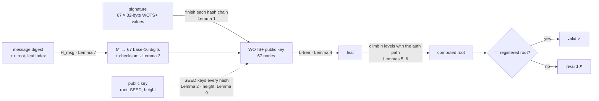

# xmss-solidity

[](https://github.com/skalenetwork/xmss-solidity/actions/workflows/ci.yml)
[](LICENSE)

**Post-quantum signatures on Ethereum, today.** Verify [XMSS](https://www.rfc-editor.org/rfc/rfc8391) signatures fully on-chain in pure Solidity, with a formal proof that the code computes exactly what RFC 8391 specifies, for every possible input.

A large enough quantum computer breaks ECDSA, and with it every Ethereum account, multisig and bridge key. XMSS is a hash-based signature scheme standardized in RFC 8391 and approved by NIST (SP 800-208). Its security rests only on the hash function, not on new mathematical assumptions. Because verifying it is pure hashing, the EVM can check it directly, with no oracle, no trusted server and no new precompile.

```solidity
import {XMSS} from "xmss-solidity/XMSS.sol";

bool ok = XMSS.verify(messageDigest, signature, XMSS.PublicKey(root, seed), treeHeight);
```

| | |
|---|---|
| **Standard** | RFC 8391, XMSS-SHA2_h_256 (SHA-256, n = 32, w = 16); NIST SP 800-208 |
| **Tree heights** | 10, 16 and 20 (up to 2^20 = 1,048,576 signatures per key); 4 for testing |
| **Gas** | about 712k at h = 10 and 745k at h = 20, using only the SHA-256 precompile |
| **Formally verified** | proven equivalent to RFC 8391's verification algorithms with [Halmos](https://github.com/a16z/halmos); the proof runs in CI on every push. See [PROOF.md](PROOF.md) |
| **Footprint** | one `internal` library: no deployment, no storage, no dependencies |
| **Licence** | MIT |

## Try it in 60 seconds

Verify real post-quantum signatures (h = 20, the largest standardized tree: over a million signatures per key) on the EVM, with [Foundry](https://getfoundry.sh):

```sh
git clone --recursive https://github.com/skalenetwork/xmss-solidity
cd xmss-solidity
forge test --match-test "test_gas_verify_h20|test_verify_h20_allVectors" -vv
```

```
[PASS] test_gas_verify_h20()
  XMSS verify gas (h=20, measured): 745003
[PASS] test_verify_h20_allVectors()
```

The signatures come from an independent Python implementation of RFC 8391 (`py/xmss_ref.py`); Solidity checks them on-chain.

## How verification works

One signature is 67 WOTS+ chain values and a Merkle path. The chain checks every stage below against RFC 8391 (the lemma numbers are the proofs in [PROOF.md](PROOF.md)):



Every arrow is SHA-256 and nothing else: roughly 1,900 to 3,400 precompile calls at h = 20, depending on the digits, no elliptic curves, no lattices, no new precompile. That is why the EVM can do it today, and why the whole computation could be proven equal to the RFC.

## Why you can trust it

Most signature code is trusted because it passed its tests. This library is also **proven**:

- **An executable copy of the RFC.** [`test/proof/RFC8391.sol`](test/proof/RFC8391.sol) transcribes RFC 8391's verification algorithms line by line, citing each section. It accepts every signature produced by an independent Python implementation of RFC 8391 (`py/xmss_ref.py`, written for this project, not the RFC authors' C reference) at h = 4, 10 and 20, and rejects each one for a different message.
- **Proven equal, for all inputs.** Halmos proves each building block of the production verifier equal to the RFC's algorithm for every input: the hash chain, RAND_HASH, the WOTS+ digits and checksum, the L-tree, each tree level, H_msg and the input checks. Deliberately planted bugs are all caught.
- **Stated assumptions.** SHA-256 is modelled as an abstract function, the proof covers one compiler configuration, and the composition for general tree heights rests on a written induction argument. [PROOF.md](PROOF.md) spells out every assumption.

## Install

### Foundry (recommended)

```sh
forge install skalenetwork/xmss-solidity@v0.1.0
```

Add the remapping to `remappings.txt` (or `foundry.toml`):

```
xmss-solidity/=lib/xmss-solidity/src/
```

### Git submodule (without `forge install`)

```sh
git submodule add https://github.com/skalenetwork/xmss-solidity lib/xmss-solidity
cd lib/xmss-solidity && git checkout v0.1.0 && cd -
```

Then add the same remapping as above.

### Hardhat or other npm-based setups

```sh
npm install github:skalenetwork/xmss-solidity#v0.1.0
```

```solidity
import {XMSS} from "xmss-solidity/src/XMSS.sol";
```

### Compiler settings

The library needs Solidity ^0.8.24 and nothing else. The formal proof covers the bytecode produced with **solc 0.8.37, via-IR, 200 optimizer runs** (see `foundry.toml`). Other compiler versions or settings compile the same source, but not the exact bytecode that was proven, so use these settings if you rely on the proof.

## Use

```solidity
import {XMSS} from "xmss-solidity/XMSS.sol";

contract MyVerifier {
    mapping(bytes32 => mapping(uint32 => bool)) public leafUsed; // per key: one-time leaves

    function check(bytes32 digest, XMSS.Signature memory sig, bytes32 root, bytes32 seed, uint256 treeHeight)
        external
    {
        bytes32 key = keccak256(abi.encode(root, seed, treeHeight));
        require(!leafUsed[key][sig.leafIdx], "leaf already used");
        require(XMSS.verify(digest, sig, XMSS.PublicKey(root, seed), treeHeight), "invalid XMSS signature");
        leafUsed[key][sig.leafIdx] = true; // XMSS is stateful: never accept a leaf twice
    }
}
```

`py/xmss_ref.py` generates keys and signatures in this format for testing.

## API reference

### `XMSS.verify`

```solidity
function verify(bytes32 messageDigest, XMSS.Signature memory sig, XMSS.PublicKey memory pk, uint256 treeHeight)
    internal view returns (bool)

function verify(bytes32 messageDigest, XMSS.Signature memory sig, XMSS.PublicKey memory pk)
    internal view returns (bool)
```

Returns `true` if and only if `sig` is a valid RFC 8391 XMSS signature on `messageDigest` under `pk`.

**Use the four-argument form.** RFC 8391's public key includes an OID that fixes the tree height; `PublicKey` does not, so pass the height you registered for the key. A signature whose `authPath` does not have exactly `treeHeight` entries is rejected. The three-argument form takes the height from `sig.authPath.length`, which lets whoever supplies the signature choose it; use it only if you check the height yourself. See [PROOF.md](PROOF.md#tree-height-and-the-public-key).

Both return `false`, without hashing anything, when:
- `pk.root` or `pk.seed` is zero (malformed key);
- the height is 0 or greater than 20;
- `sig.leafIdx` is not below 2^h.

Otherwise they recompute the tree root from the signature (Algorithms 13 and 14 of RFC 8391) and return whether it equals `pk.root`.

They revert, with empty revert data, only if a SHA-256 precompile call fails, which happens when the transaction runs out of gas. Each precompile call gets a fixed 1,000-gas stipend.

`view` because they call the SHA-256 precompile; they read no storage. The library is `internal`, so it is compiled into your contract and needs no separate deployment.

**What the caller must do:**
- **Consume each leaf once per key.** The library is stateless. Accepting two signatures with the same `leafIdx` under one key lets an attacker forge; see the example above.
- **Bind the context into `messageDigest`.** Sign an EIP-712 digest (or similar) that includes the chain id, your contract's address and a nonce, so a signature can't be replayed elsewhere.
- **Pin the key and its height.** Accept only public keys registered through a trusted process, and pass each key's registered height; the library checks signatures against whatever key it is given.

### `XMSS.PublicKey`

```solidity
struct PublicKey {
    bytes32 root; // Merkle tree root
    bytes32 seed; // public SEED: keys and bitmasks for the hash functions
}
```

The root and SEED of RFC 8391's public key (§4.1.7). The RFC's key also carries an OID that fixes the parameter set and tree height; here the caller supplies the height to `verify`.

### `XMSS.Signature`

```solidity
struct Signature {
    uint32 leafIdx;       // idx_sig: the one-time leaf index
    bytes32 r;            // randomizer for H_msg
    bytes32[67] wotsSig;  // WOTS+ signature, 67 x 32 bytes
    bytes32[] authPath;   // authentication path, h x 32 bytes (h = tree height)
}
```

The XMSS signature of RFC 8391 §4.1.8: 4 + 32 × (68 + h) bytes, e.g. 2,820 bytes at h = 20.

### Constants

| Name | Value | Meaning |
|---|---|---|
| `XMSS.LEN` | 67 | WOTS+ chains per signature (len) |
| `XMSS.LEN1` | 64 | message chains (len_1); the other 3 are checksum chains |
| `XMSS.W_MINUS_1` | 15 | chain length, w − 1 |
| `XMSS.MAX_HEIGHT` | 20 | largest supported tree height |

### Internal building blocks

`hMsg`, `rootFromSig`, `climbStep`, `wotsPkFromSig`, `wotsChecksum`, `wotsDigit`, `chain`, `ltree`, `randHash`, `prf`, `fHash`, `hHash` and `adrs` are `internal` so the proofs can check each one against the RFC. They are not a stable API: call `verify`.

## Layout

| Path | What |
|---|---|
| `src/XMSS.sol` | the verifier |
| `test/proof/RFC8391.sol` | executable specification: RFC 8391's verification algorithms, transcribed line by line |
| `test/proof/XMSSEquivalence.t.sol` | the Halmos proofs, and the specification checked against the reference vectors |
| `test/XMSS.t.sol`, `test/XMSSProperties.t.sol` | unit, gas and fuzz tests |
| `test/vectors/` | signatures from the independent Python implementation, h = 4, 10 and 20 |
| `py/xmss_ref.py` | independent Python implementation of RFC 8391 (key generation, signing, verification), written for this project; regenerates the h = 4 and 10 vectors |
| `py/gen_h20.py` | regenerates the h = 20 vectors (about 10 minutes on all cores) |
| `py/sign_digest.py` | test helper: signs a digest with a deterministic test key, for Foundry FFI |

## Test and prove

```sh
forge test
halmos --match-contract XMSSEquivalence --loop 70 --solver-timeout-assertion 0
```

Halmos 0.3.3 needs a one-line fix to its SHA-256 model first; see [PROOF.md](PROOF.md#assumptions-and-trust-base) and the CI workflow.

## Used by

- [FermionWallet](https://github.com/skalenetwork/fermionwallet): post-quantum second authorization for Gnosis Safe. Every transfer needs a hybrid ECDSA + XMSS approval from a Ledger, verified on-chain with this library.

## Status and security

The verifier is formally verified against RFC 8391 but **not audited**. Signing and key generation must happen off-chain, in hardware that never reuses a leaf. Report security issues privately to the maintainers rather than in a public issue.

## Licence

MIT.
